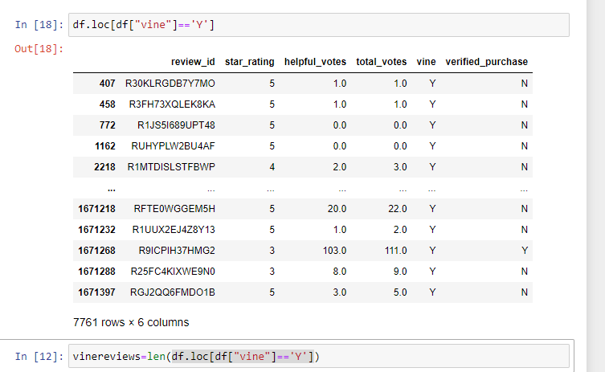
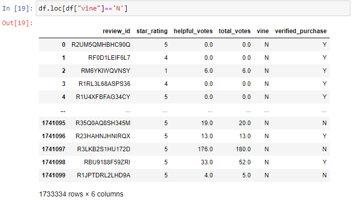
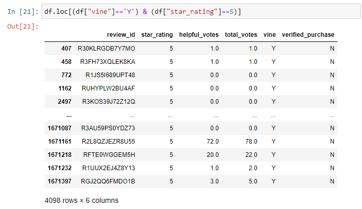
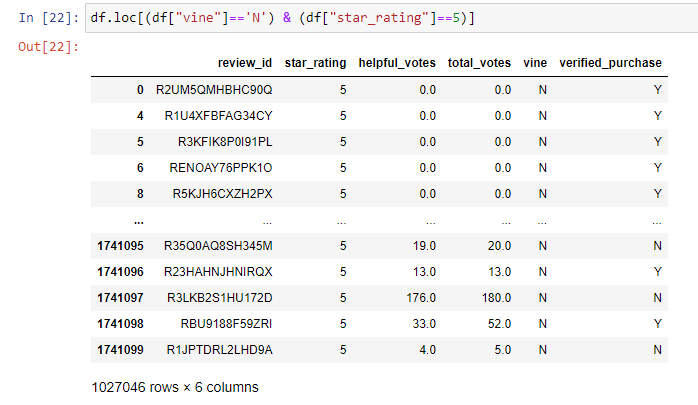

# BigData(17)

## Overview of the analysis
In this module challenge we want to examine the results of companies like SellBy who provide products to Amazon Vine members who are required to publish a review. Technically we are performing the ETL process to extract, transform, and load data into a database which is connected to Amazon AWS services. This process is a common process today in data science. Specifically, we are looking for bias towards Vine members in the data set.
Does having a paid Vine review make a difference in the percentage of 5-star reviews?
*	Do people who pay for Vine statistics more likely to get positive reviews?  It seems the answer is NO.

## Results
	Number of Vine reviews. 7761

	Number of non-Vine reviews. 1,733,334

	Number of 5 star Vine reviews. 4098

	Number of non-Vine reviews that were 5 star. 1,027,046

## Summary
Is there any positivity bias for reviews in the Vine program?
*	There are 52.8% five star Vine reviews, and 59.3% five star NON-Vine reviews.
*	This seems to indicate that no positivity bias exists in the study.
## Additional analysis for the dataset to support this.
*	4 star and/or 4 and 5 star reviews and percentages might be helpful.
